# maths 1 , 16 questions

# 46)
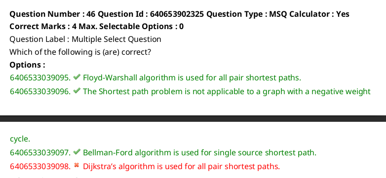
doubt

# 47)
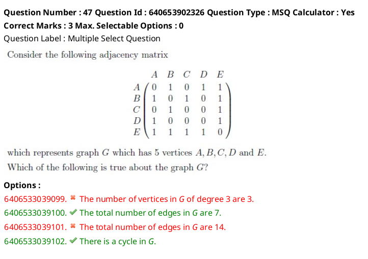
doubt

# 48)
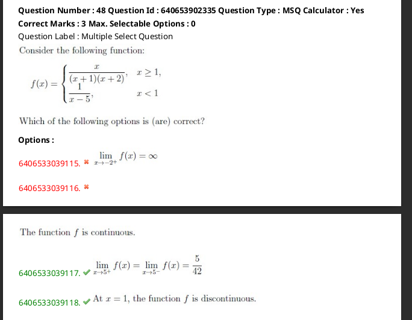

# 49)
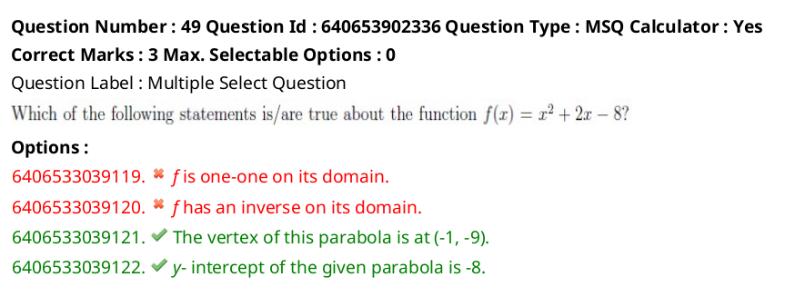
doubt

The question is about analyzing properties of the quadratic function \( f(x) = x^2 + 2x - 8 \). Let's go through the options step by step:

1. **\( f \) is one-one on its domain**:  
   - A function is one-one (injective) if it assigns distinct outputs to distinct inputs.  
   - \( f(x) = x^2 + 2x - 8 \) is a parabola that opens upwards, so it is not one-one over its entire domain (\( \mathbb{R} \)), as it fails the horizontal line test.  
   - This statement is **false**.

2. **\( f \) has an inverse on its domain**:  
   - A function has an inverse if it is both one-one and onto over its domain. Since \( f(x) \) is not one-one, it does not have an inverse on its entire domain.  
   - This statement is **false**.

3. **The vertex of this parabola is at \((-1, -9)\)**:  
   - The vertex of a parabola \( f(x) = ax^2 + bx + c \) is given by \( x = -\frac{b}{2a} \).  
     Here, \( a = 1 \), \( b = 2 \), and \( c = -8 \).  
     \( x = -\frac{2}{2 \cdot 1} = -1 \).  
     Substitute \( x = -1 \) into \( f(x) \):  
     \( f(-1) = (-1)^2 + 2(-1) - 8 = 1 - 2 - 8 = -9 \).  
   - The vertex is indeed \((-1, -9)\).  
   - This statement is **true**.

4. **The \( y \)-intercept of the given parabola is \(-8\)**:  
   - The \( y \)-intercept is the value of \( f(x) \) when \( x = 0 \).  
     \( f(0) = (0)^2 + 2(0) - 8 = -8 \).  
   - This statement is **true**.

### Final Answer:  
Options **3** and **4** are correct.

# 50)
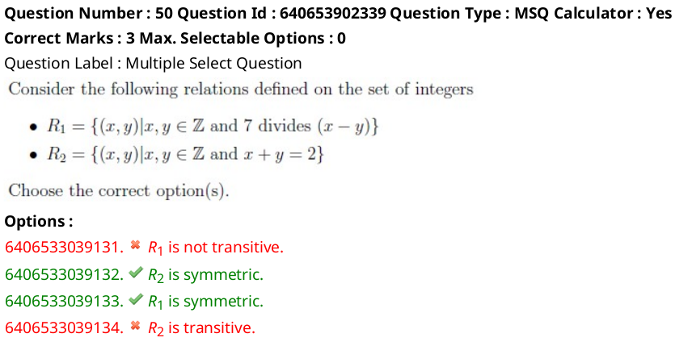

# 51)
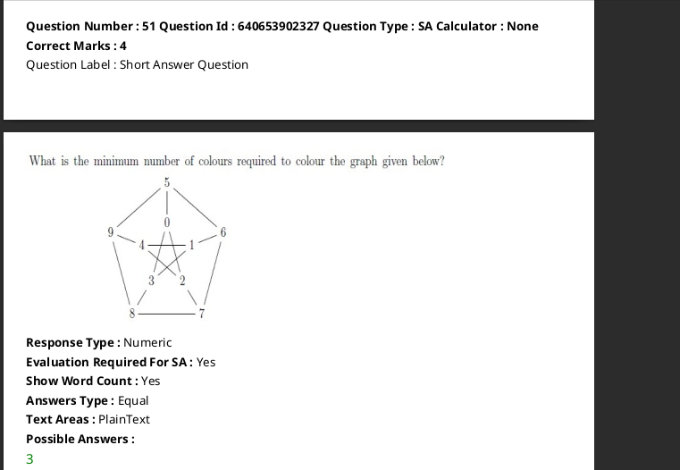
- graph colouring algo

# 52)
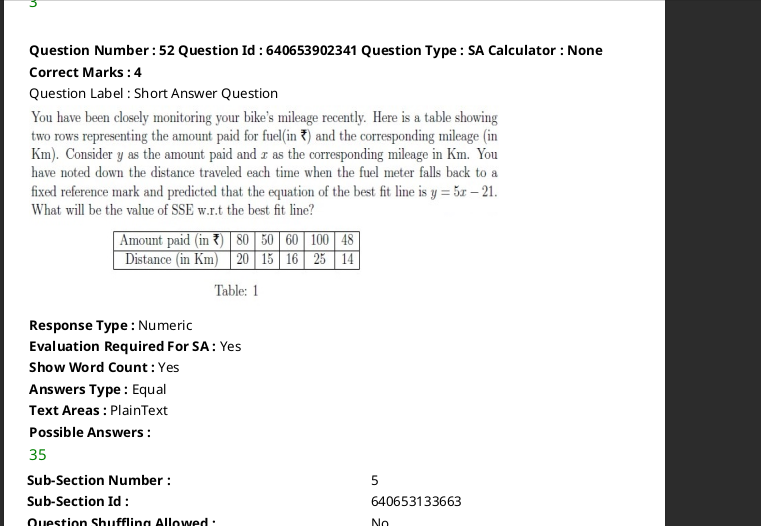

# 53)
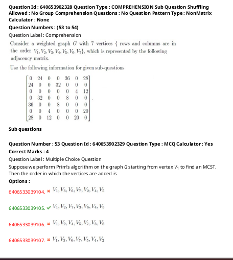
- prim's

# 54)
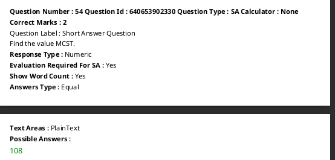

# 55)
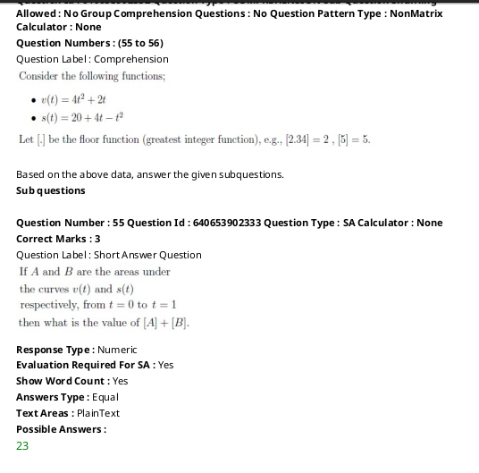
- 4t**2+2t
    - 4*(t**3)/3 + 2*t**2/2
    -> [1,0]
    - > 4/3+1 => 2.33
- 20+4t-t**2
    - 20t + 4t**2/2 - t**3/3
    - [1,0]
    -> 20+2-1/3 =21.66 
    -> 0+0+0

The question asks to calculate the areas \( A \) and \( B \) under the curves \( v(t) = 4t^2 + 2t \) and \( s(t) = 20 + 4t - t^2 \) respectively, over the interval \( t \in [0, 1] \), and then determine the value of \( \lfloor A \rfloor + \lfloor B \rfloor \).

### Solution Steps:
1. Compute the definite integral of \( v(t) \) from 0 to 1:
   \[
   A = \int_0^1 (4t^2 + 2t) \, dt
   \]

2. Compute the definite integral of \( s(t) \) from 0 to 1:
   \[
   B = \int_0^1 (20 + 4t - t^2) \, dt
   \]

3. Take the floor of \( A \) and \( B \), i.e., \( \lfloor A \rfloor \) and \( \lfloor B \rfloor \), and add them.

Let me calculate the integrals.

The areas under the curves are:

- \( A = \frac{7}{3} \approx 2.33 \)
- \( B = \frac{65}{3} \approx 21.67 \)

Taking the floors:
- \( \lfloor A \rfloor = 2 \)
- \( \lfloor B \rfloor = 21 \)

Thus, \( \lfloor A \rfloor + \lfloor B \rfloor = 23 \).

# 56)
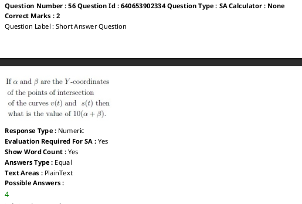
- doubt

# 59)
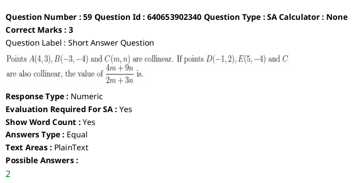

# 60)
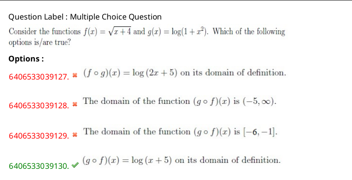

# 61)
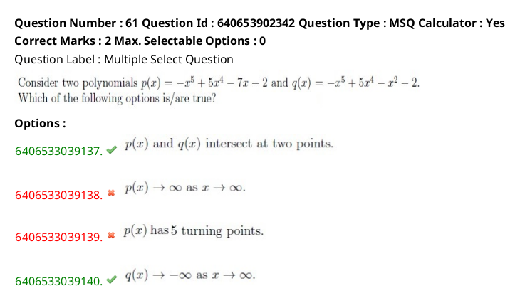